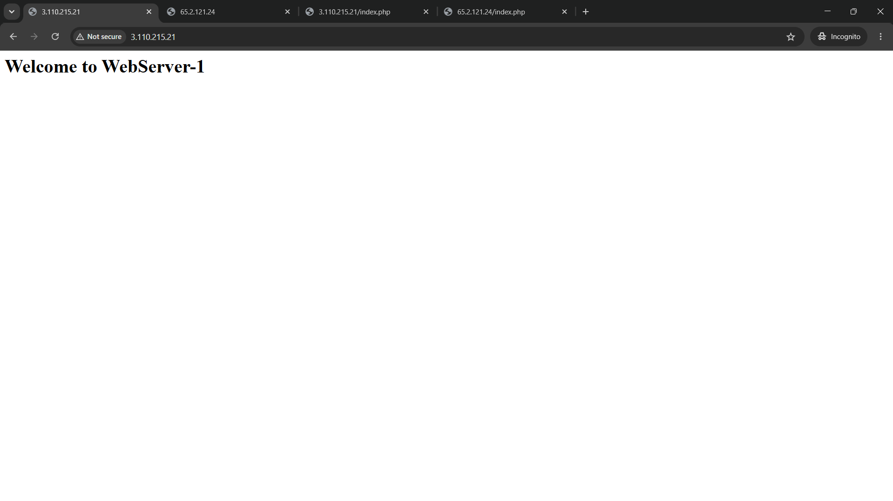
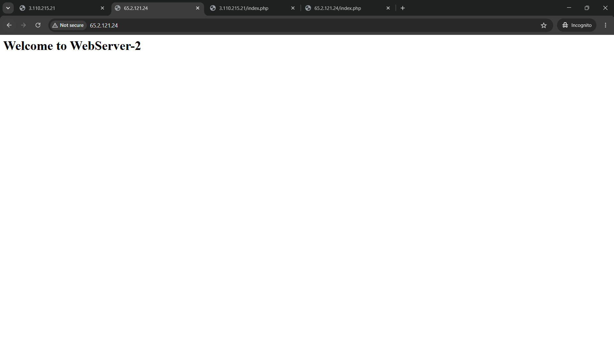
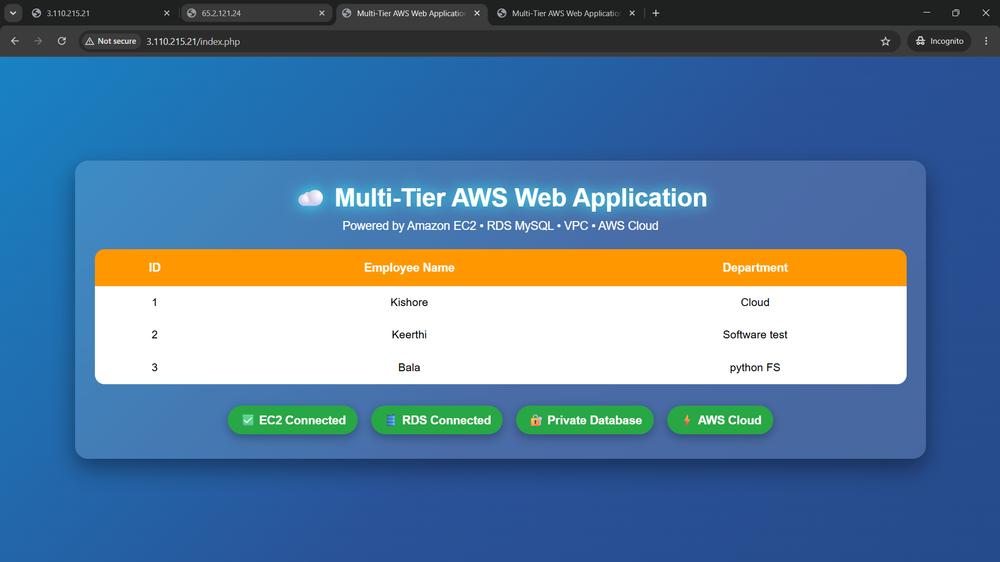
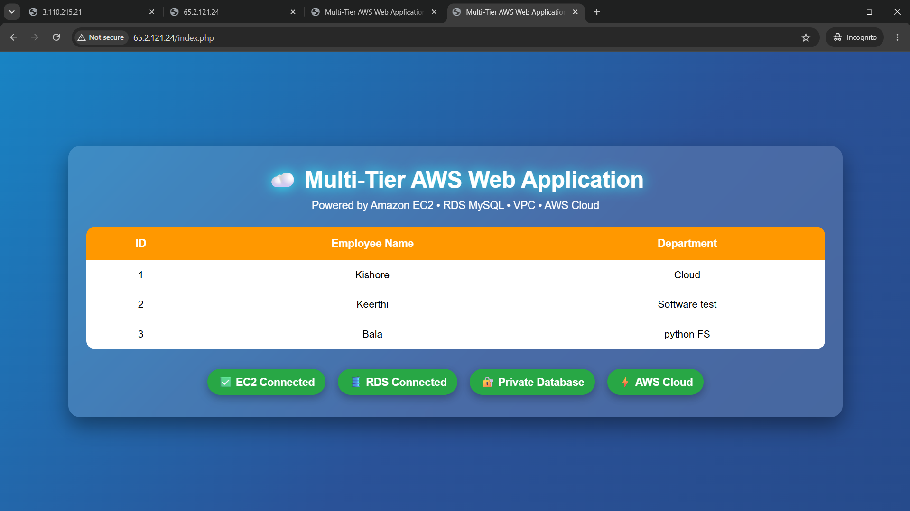
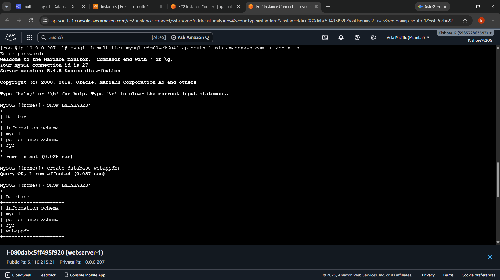
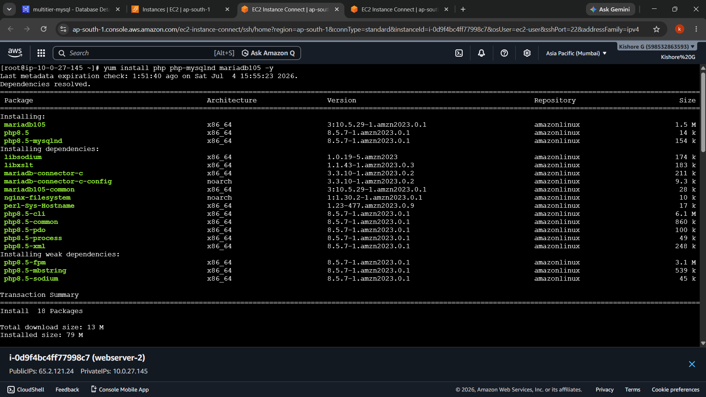
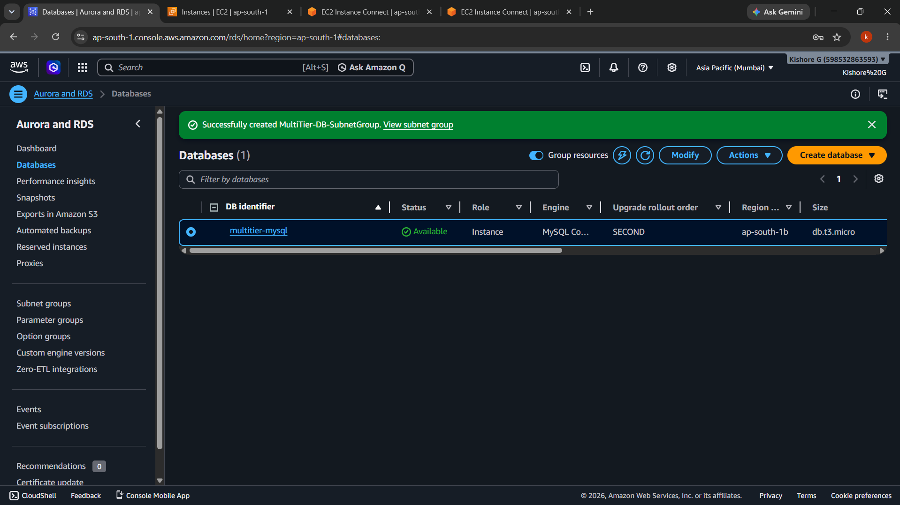
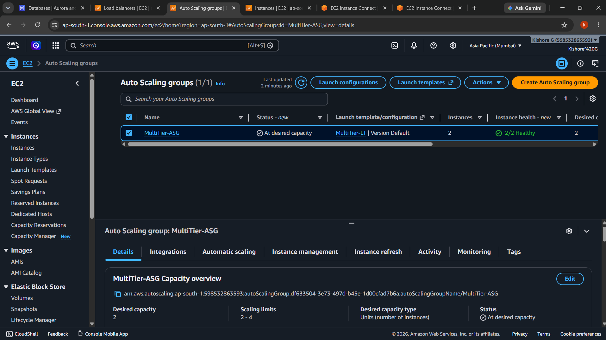
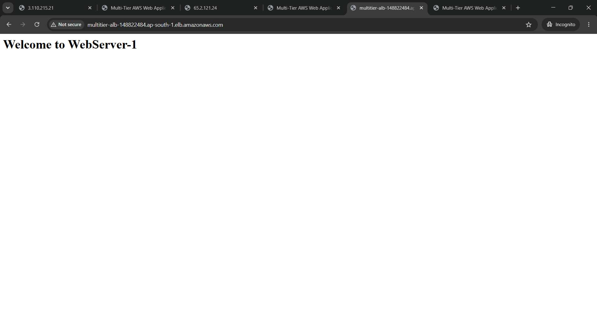
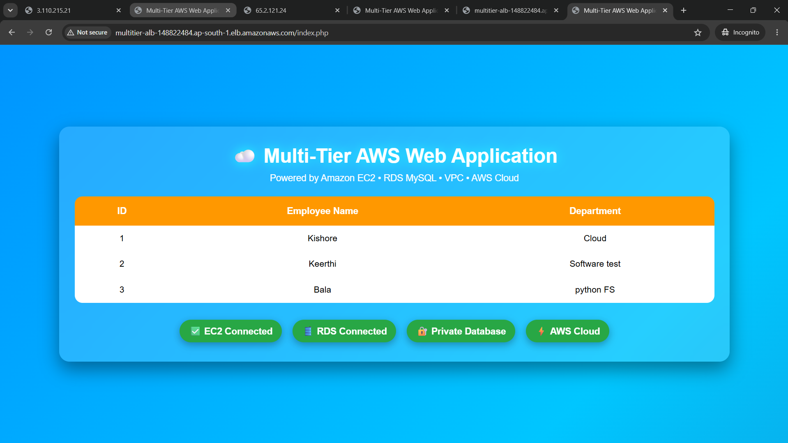

<div align="center">

# ☁️ AWS Multi-Tier Web Application Deployment

### 🚀 Production-Ready Highly Available Three-Tier Web Application on AWS

<p align="center">


</p>

### 🌍 Deploying a Secure, Scalable and Highly Available Web Application using AWS Cloud Services

</div>

---

# 📖 Project Overview

This project demonstrates a **Production-Ready Multi-Tier Web Application Deployment** on **Amazon Web Services (AWS)**.

The infrastructure is designed using a **Three-Tier Architecture** that separates the application into different layers for improved **security**, **scalability**, and **high availability**.

The application consists of:

- 🌐 Web Tier – Amazon EC2 (Apache + PHP)
- ⚖️ Load Balancing Tier – Application Load Balancer (ALB)
- 🛢 Database Tier – Amazon RDS MySQL
- 📈 Auto Scaling – Automatic instance replacement and scaling
- 🔒 Secure Networking – Amazon VPC with Public & Private Subnets

---

# 🏗 Architecture Diagram

> Replace this image with your AWS architecture diagram.

<p align="center">


</p>

---

# ☁️ AWS Services Used

| AWS Service | Purpose |
|-------------|---------|
| Amazon VPC | Virtual Private Cloud |
| Public Subnets | Host Web Servers |
| Private Subnets | Host Database |
| Internet Gateway | Internet Access |
| Route Tables | Network Routing |
| Security Groups | Firewall Rules |
| Amazon EC2 | Web Servers |
| Apache HTTP Server | Web Server |
| PHP | Dynamic Web Application |
| Amazon RDS MySQL | Relational Database |
| Application Load Balancer | Traffic Distribution |
| Target Group | Backend Registration |
| Health Checks | Monitor Instance Health |
| Auto Scaling Group | Automatic Scaling & Self-Healing |
| Launch Template | Standard EC2 Configuration |
| Amazon Machine Image (AMI) | Golden Image |

---

# ✨ Features

- ✅ Custom Amazon VPC
- ✅ Public & Private Subnets
- ✅ Internet Gateway
- ✅ Route Tables
- ✅ Security Groups
- ✅ Amazon EC2 Web Servers
- ✅ Apache Web Server
- ✅ PHP Application
- ✅ Amazon RDS MySQL
- ✅ Application Load Balancer
- ✅ Target Group
- ✅ Auto Scaling Group
- ✅ Launch Template
- ✅ Health Checks
- ✅ High Availability
- ✅ Self-Healing Infrastructure
- ✅ Production-Style AWS Architecture

---

# 🏛 Architecture Flow

```text
                    Internet
                        │
                        ▼
          Application Load Balancer
                        │
              ┌─────────┴─────────┐
              │                   │
        EC2 Web Server 1    EC2 Web Server 2
         Apache + PHP        Apache + PHP
              │                   │
              └─────────┬─────────┘
                        │
                 Amazon RDS MySQL
               (Private Subnets)
                        │
               Auto Scaling Group
```

---

# 🚀 Deployment Steps

## Phase 1 – Networking

- Created Custom VPC
- Created Public Subnets
- Created Private Subnets
- Configured Internet Gateway
- Configured Route Tables
- Created Security Groups

---

## Phase 2 – Web Tier

- Launched Amazon EC2 Instances
- Installed Apache Web Server
- Installed PHP
- Configured Web Application

---

## Phase 3 – Database Tier

- Created Amazon RDS MySQL
- Created DB Subnet Group
- Configured Secure Database Connectivity

---

## Phase 4 – Web Application

- Connected EC2 to Amazon RDS
- Created Database
- Created Employee Table
- Developed PHP Application

---

## Phase 5 – Load Balancing

- Created Target Group
- Registered EC2 Instances
- Configured Health Checks
- Created Application Load Balancer

---

## Phase 6 – Auto Scaling

- Created Amazon Machine Image (AMI)
- Created Launch Template
- Configured Auto Scaling Group
- Enabled Automatic Recovery

---

# 📂 Project Structure

```text
aws-multi-tier-web-application/

│── README.md
│── LICENSE

├── application/
│      └── index.php

├── architecture/
│      └── architecture-diagram.png

├── screenshots/
│      ├── 01-webserver-1-default-page.png
│      ├── 02-webserver-2-default-page.png
│      ├── 03-webserver-1-php-application.png
│      ├── 04-webserver-2-php-application.png
│      ├── 05-rds-mysql-database-created.png
│      ├── 06-rds-mysql-connection.png
│      ├── 07-php-mysql-installation.png
│      ├── 08-auto-scaling-group.png
│      ├── 09-alb-load-balancing-default.png
│      └── 10-alb-final-web-application.png
```

---

# 📸 Project Screenshots

## 1️⃣ WebServer-1 Default Page



---

## 2️⃣ WebServer-2 Default Page



---

## 3️⃣ PHP Application Running on WebServer-1



---

## 4️⃣ PHP Application Running on WebServer-2



---

## 5️⃣ Amazon RDS MySQL Database



---

## 6️⃣ EC2 Successfully Connected to RDS



---

## 7️⃣ PHP & MySQL Installation



---

## 8️⃣ Auto Scaling Group



---

## 9️⃣ Application Load Balancer



---

## 🔟 Final Application Accessed through ALB



---

# 🔐 Security Design

- Amazon RDS deployed in **Private Subnets**
- Application Load Balancer exposed to the Internet
- EC2 Instances accessible only through the ALB
- Database accessible only from EC2 Security Group
- Security Groups configured using least privilege access

---

# 📈 High Availability Features

- Multi-AZ Deployment
- Application Load Balancer
- Auto Scaling Group
- Health Checks
- Automatic Instance Replacement
- Fault Tolerance

---

# 💡 Skills Demonstrated

- Amazon VPC
- EC2
- RDS MySQL
- Apache
- PHP
- MySQL
- Application Load Balancer
- Auto Scaling
- Launch Template
- Amazon Machine Image
- Linux Administration
- AWS Networking
- High Availability
- Fault Tolerance
- Infrastructure Design

---

# 🎯 Learning Outcomes

Through this project I learned:

- Designing Secure AWS Networking
- Deploying Highly Available Infrastructure
- Configuring Amazon EC2
- Managing Amazon RDS
- Connecting EC2 with MySQL
- Deploying PHP Applications
- Configuring Load Balancing
- Implementing Auto Scaling
- Performing Health Checks
- Building Production-Ready Cloud Infrastructure

---

# ❓ Interview Questions Covered

- What is Three-Tier Architecture?
- Why do we use Public & Private Subnets?
- Why is RDS deployed in Private Subnets?
- What is the purpose of an Application Load Balancer?
- What is a Target Group?
- How do Health Checks work?
- What is Auto Scaling?
- Difference between ALB and NLB?
- Difference between AMI and Launch Template?
- How does Self-Healing work?

---

# 🏆 Project Highlights

- ✔ Production-Ready AWS Infrastructure
- ✔ Secure Network Design
- ✔ Multi-Tier Architecture
- ✔ High Availability
- ✔ Auto Scaling
- ✔ Self-Healing
- ✔ Load Balancing
- ✔ AWS Best Practices
- ✔ Resume & Interview Ready

---

# 👨‍💻 Author

## **Kishore G**

**Aspiring Cloud & DevOps Engineer**

💼 LinkedIn: https://www.linkedin.com/in/kishore-g005

💻 GitHub: https://github.com/KISHORE-2605

---

<div align="center">

## ⭐ If you found this project helpful, please consider giving it a Star!

### Made with ❤️ using Amazon Web Services

</div>
